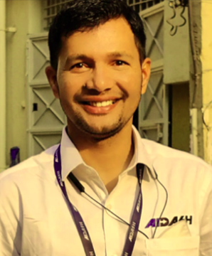
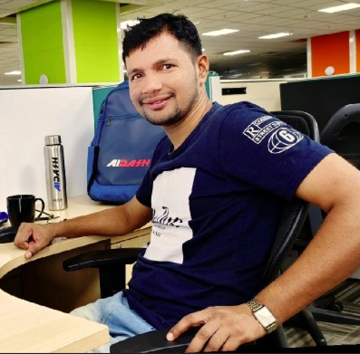

<!--
CHECKLIST FOR THIS PAGE:
- [ ] Replace [YOUR NAME] with your full name (3 places)
- [ ] Replace [YOUR JOB TITLE] with your current or target role
- [ ] Replace [YOUR TAGLINE] with a short phrase describing your focus
- [ ] Rewrite the About Me paragraph with your own words
- [ ] Replace assets/images/profile.png with your actual photo (keep the filename or update it below)
- [ ] Replace assets/images/about.png with your own image (a field photo, map, or workspace shot)
- [ ] Edit the skill cards to match your actual skills (add, remove, or rename cards as needed)
- [ ] Update GitHub and LinkedIn links in the Connect section
- [ ] Add your CV PDF to docs/assets/ and update the filename in the Download CV button
-->

  
  <h1>PAWAN KUMAR</h1>
  
<strong>Lead Geospatial Analyst</strong>

  
<em>..automating traditional manual geospatial workflows | GIS | Lidar | Remote Sensing | Python</em>

---

## About Me

Lead Geospatial Analyst with expertise in automating geospatial production, QC/QA workflows, and operational processes. I have developed 25+ apps/tools/plugins and 50+ scripts, reducing geospatial processing time and costs by 30–40%. I specialize in extracting actionable insights from satellite/aerial/UAV imagery and large spatial datasets using Python, Google Earth Engine, and open-source GIS tools, with a strong focus on Geospatial and AI-powered workflow optimization. I am proficient in modern AI tools such as ChatGPT, Claude, Cursor, and Kiro, and am currently exploring opportunities in advanced geospatial analytics, computer vision, and scalable Geospatial solutions.

  

---

[View My Projects :material-arrow-right:](projects/index.md){ .md-button .md-button--primary }
[Download CV :material-download:](assets/Pawan-CV.pdf){ .md-button }

---

## Skills

-   **GIS & Remote Sensing**

    ---

    - QGIS, ArcGIS Pro, Erdas Imagine, Google Earth Engine
    - GDAL / OGR, OSGeo4W
    - Multispectral and Aerial image analysis, Lidar data processing
    - Large spatial data analysis

-   **Programming**

    ---

    - Python — GeoPandas, NumPy, Pandas, Matplotlib, Rasterio, Shapely, Fiona
    - JavaScript — Leaflet
    - SQL, PostgreSQL + PostGIS

-   **Machine Learning & GeoAI**

    ---

    - Supervised classification — Random Forest
    - Deep learning for image segmentation — SAM
    - scikit-learn, PyTorch, OpenCV
    - Object detection in satellite imagery

-    **Web Mapping & Data**

    ---

    - Leaflet.js
    - Cloud storage — AWS S3, Google Cloud Storage
    - Data formats — GeoTIFF, shp
    - Streamlit for data-driven web apps

-   **Data & Cloud**

    ---

    - PostgreSQL + PostGIS
    - Cloud storage: AWS S3, Google Cloud Storage
    - Data formats: GeoJSON, SHP, GPKG, KMZ,  GeoTIFF

-   **Drone / UAV Data Processing**

    - Point cloud processing: CloudCompare, PDAL, ArcPy

---

## Connect

[GitHub](https://github.com/Spawankush){ .md-button }
[LinkedIn](https://linkedin.com/in/pawan-kumar-aidash){ .md-button }
